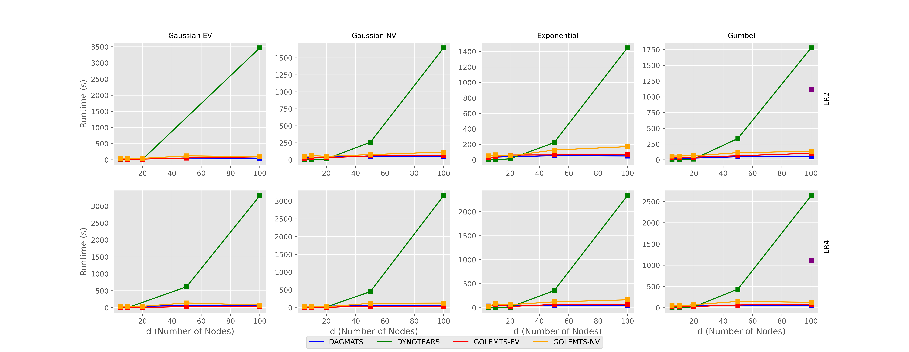

### Valen Potloff
### Tyler Gibbs
### Biwei Huang
### Babak Salimi

# Introduction 

This project extends recent advancements in causal discovery to timeseries data with instantanious and time lagged effects. These algorithems can be used to discover not just the size of an effect but also the direction of causality from timeseries data. We adapt 2 algorithems, GOLEM and DAGMA, to timeseries and compare it to a similar existing algorithem DYNOTEARS. We have named our adaptations GOLEMTS(GOLEM Time Series) and DAGMATS(DAGMA Time Series). 


## Causal Discovery

Causal discovery is the term for learning to direction of a causal effect from data. While we might know variables A and B are correlated determining which causes the other or if they are the result of a third effect is much more difficult. The methods discussed here will only consider the case where the casual graph forms a Directed Ascyclic Graph(DAG), where no causal loops form. A variety of tools have been developed to solve this problem, recently algorithems that formulate this as a continoues optimisation problem have been an active area of research. NOTEARS first formulated this as a continuous constrained optimization task using a hard DAG constraint.

## Relevance 


Unfortunately much of the data we would like to find causal relationships in is very large and the computationaly intensive nature of known algorithems is limits the impact of this field in active research. However in many situations researchers are dealing with timesearies data where they are looking for both instant and time lagged effects. If we can incorperate assumptions about this data into these algorithems that dramaticaly narrow the range of data we need to perform the most computationaly intensive calculations we can see significant improvments to our analisys.

## DYNOTEARS

In 2020 NOTEARS was addapted to the timeseries data with the createtion of DYNOTEARS. This divieded the data into two sections, instantanious effects and time lagged effects. Time lagged effects can not be affected by variables measured in the future, incorperating these assumptions into the algorithem allowed to to more accurately and much more quickly prosses datasets. We take this approach and extend it to GOLEM and DAGMA. Since GOLEM and DAGMA are more sognificantly moreaccurate than DYNOTEARS on large datasets our implementations of these algorithems for timeseries datasets has seen a similar improvment over DYNOTEARS.  

We provide an implementation of DYNOTEARS primaraly to serve as a baseline to compare GOLEMTS and DAGMATS as they are superior in nearly every circumstance.

## GOLEMTS

GOLEM built on NOTEARS' success by showing that with a better formulation of the likelyhood function and a soft sparcity constraint the hard dag constraint could be weakend to a soft constraint. This unconstrained opti- mization problem was much easier to solve. We extend the likelyhood function developed for GOLEM for time lagged effects resulting in GOLEMTS. The specifics of how this works mathematicaly can be found in the report.pdf in the linked githubrepository.

GOLEM has two seperate implementations, GOLEM_EV assumes equal variences amoung the variables while GOLEM_NV does not, we mirror this in our implementation with GOLEMTS_EV and GOLEMTS_NV.

## DAGMATS

DAGMA incorperates assumtions about how matrix representations of DAGs for M-matrixes to create a DAG constraint with better performing gradiants which allow standard optimisation methods to reach the true DAG representing the causal effects faster and more accuratly. We apply this new constraint to the objective function we developed for the previous methods to get DAGMATS. Again the specifics of how this is accomplished can be found in report.pdf.

# Results

The following graphs show the reletive performace of DYNOTEARS, GOLEM_EV, GOLEM_NV, and DAGMATS with datasets of increasing size generated with equal varience gausian noise, noequal varience gausian noise, eponential noise, and gumbal noise.

First we examine the runtime and see that GOLEM_EV, GOLEM_NV, and DAGMATS perform significantly better on large datasets than DYNOTEARS.

[]()

There are many ways to measure error when finding causal graphs. We will look at two, the true positive rate and structural haming distance.

The true positive rate is exactly what it sounds like. The percent of predicted links that are true, a higher number is better.

Structural hamning distance is the number of additions or removals required to change our predicted graph to the true graph. Lower is better.

First we examine the true positve rate and see a significant divergence where we see that on larger datasets DYNOTEARSTS and DAGMATS maintain their precision but GOLEMTS suffers significantly.

[]()

However this story is complicated when we also look at structural hamning distance where both implementations of GOLEMTS outperform both DAGAMTS and and DYNOTEARS, although by a more modest degree. 

[]()

# Usage

## Run your own

We have provided implementations of DYNOTEARS GOLEMTS and DAGMATS. You can run these on your own datasets or on Synthetic datasets generated by our implementation. We provide two primary methods from running these algorithems, from the main method and from a call to the underlying python function. 

### main.py

You can run each method on generated data or a provided csv file using 'python main.py' comand from the root directory

'python main.py' is followed by the name of the method (DYNOTEARS, GOLEMTS, DAGMATS) followed by arguments specifying the data and output directory.

-p is the number of different times slots in the data and must always be specified

If you are using existing data you give the filename of the csv file under --data as shown below

```rb
python3 main.py GOLEMTS \
                      --data filename.csv \
                      -p 1
```

If no --out paramiter is specified it will write to output.json. If the --out paramiter is specified it will write to that file. The output is a json object containing the original casual graph if known and the estimated causal graph, allowing the user to analise the accuracy.

```rb
python3 main.py GOLEMTS \
                      --data filename.csv \
                      -p 1 \
                      --out new_output.json
```

It can also generate synthetic data using the following two paramiters
* -n number of observations
* -d number of variables
* --degree number of causal relationships to model

The method will then be ran on the synthetic data and the estimated graph will be writen to the output file

```rb
python3 main.py GOLEMTS \
                     -n 10 \
                     -d 3 \
                     -p 1 \
                     --degree 4

python3 main.py  DAGMATS \
                     -n 10 \
                     -d 3 \
                     -p 1 \
                     --degree 4 \

python3 main.py  DYNOTEARS \
                     -n 10 \
                     -d 3 \
                     -p 1 \
                     --degree 4 \
                     --out new_output.json
```


### Direct Python Calls

This method provides the highest degree of custemisation. Each function in formated to take the number of oberservations(n), number of variables per timeslot(d), number of timeslots(p) followed by the data(Y) formated with n rows and d*p columns. After these positional arguments are the particular methods hyperparamiters as discused in the methods section in the introduction. Last is the number of itterations to run(epochs) before returning the best estimate.

* src.train.run_DYNOTEARS(n, d, p, Y, w_thresh=0.01, epochs=100):

* src.train.run_GOLEMTS(n, d, p, Y, lambda_1=0.1, lambda_2=1, ev=True, lr=3e-3, lambda_3=9, epochs=1000, warmup_epochs=0):

* src.train.run_DAGMATS(n, d, p, Y, lambda1=0.01, lambda2=0.03, lr=0.02, w_threshold=0, epochs=1000) 

# Reference
Ng, Ignavier, AmirEmad Ghassami, and Kun Zhang. "On the role of sparsity and dag constraints for learning linear dags." *Advances in Neural Information Processing Systems* 33 (2020): 17943-17954.

Zheng, Xun, et al. "Dags with no tears: Continuous optimization for structure learning." *Advances in neural information processing systems* 31 (2018).

Bello, Kevin, Bryon Aragam, and Pradeep Ravikumar. "Dagma: Learning dags via m-matrices and a log-determinant acyclicity characterization." *Advances in Neural Information Processing Systems* 35 (2022): 8226-8239.

Pamfil, Roxana, et al. "Dynotears: Structure learning from time-series data." International Conference on Artificial Intelligence and Statistics. PMLR, 2020.
